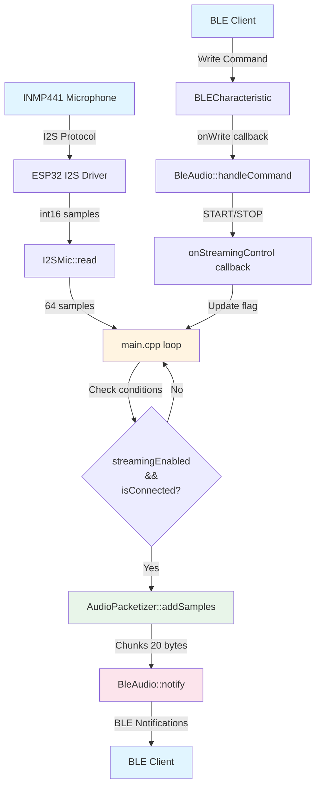

# AIGlasses Firmware - Architecture & Code Breakdown

## Table of Contents
1. [Overview](#overview)
2. [System Architecture](#system-architecture)
3. [Module Breakdown](#module-breakdown)
4. [Data Flow](#data-flow)
5. [Component Interactions](#component-interactions)
6. [Key Design Decisions](#key-design-decisions)
7. [Configuration](#configuration)

---

## Overview

This firmware streams raw PCM audio from an INMP441 I2S microphone over Bluetooth Low Energy (BLE) to a connected device. The system is designed with a **modular architecture** where each component has a single, well-defined responsibility.

### Core Functionality
- **Audio Capture**: Reads 16-bit PCM samples from I2S microphone at 44.1kHz
- **BLE Streaming**: Sends audio data via BLE notifications (20 bytes per chunk)
- **Control Protocol**: Text-based commands (START/STOP/PING/INFO) for remote control
- **State Management**: Tracks connection status and streaming state

---

## System Architecture

### High-Level Architecture

```
┌─────────────────────────────────────────────────────────────┐
│                        ESP32 Device                         │
│                                                             │
│  ┌──────────────┐    ┌──────────────┐    ┌──────────────┐ │
│  │   I2SMic     │───▶│ AudioPacket │───▶│   BleAudio   │ │
│  │              │    │   izer      │    │              │ │
│  │ - I2S Driver │    │ - Chunking  │    │ - BLE Server │ │
│  │ - Pin Config │    │ - Packing   │    │ - Notify     │ │
│  │ - Read       │    │ - Flush     │    │ - Commands   │ │
│  └──────────────┘    └──────────────┘    └──────────────┘ │
│         │                    │                    │          │
│         └────────────────────┴────────────────────┘          │
│                            │                               │
│                    ┌───────▼────────┐                      │
│                    │    main.cpp    │                      │
│                    │  - Orchestrates│                      │
│                    │  - State mgmt │                      │
│                    └────────────────┘                      │
└─────────────────────────────────────────────────────────────┘
                            │
                            │ BLE
                            ▼
                    ┌──────────────┐
                    │  BLE Client  │
                    │ (Phone/PC)   │
                    └──────────────┘
```

### Visual Data Flow Diagram



### Module Responsibilities

| Module | Responsibility | Dependencies |
|--------|---------------|--------------|
| **I2SMic** | I2S hardware interface, audio capture | ESP-IDF I2S driver |
| **AudioPacketizer** | Sample chunking, byte packing | None (pure logic) |
| **BleAudio** | BLE communication, control protocol | ESP32 BLE Arduino |
| **main.cpp** | Orchestration, state management | All modules |

---

## Module Breakdown

### 1. I2SMic Module

**Purpose**: Interface with the INMP441 I2S microphone hardware

**Files**: `include/i2s_mic.h`, `src/i2s_mic.cpp`

#### Key Components

```cpp
class I2SMic {
    bool initialized;        // State tracking
    i2s_port_t port;         // I2S port (I2S_NUM_0)
    
    bool init();              // Initialize I2S driver
    size_t read(...);         // Read audio samples
    void stop();              // Cleanup
};
```

#### Initialization Process

1. **Configure I2S Driver** (`i2s_config_t`):
   - Mode: Master + RX (receive)
   - Sample rate: 44,100 Hz
   - Bit depth: 16 bits
   - Channel: Left only (mono)
   - DMA buffers: 4 buffers × 64 samples each

2. **Configure Pins** (`i2s_pin_config_t`):
   - WS (Word Select): GPIO 23
   - SD (Serial Data): GPIO 22
   - SCK (Bit Clock): GPIO 19

3. **Start Driver**: Install, configure pins, start I2S

#### Reading Samples

```cpp
size_t read(int16_t* buffer, size_t buffer_len)
```

- Reads `buffer_len` samples (int16_t values)
- Uses `i2s_read()` with `portMAX_DELAY` (blocks until data available)
- Returns actual number of samples read
- Each sample is a signed 16-bit integer (-32,768 to 32,767)

#### Data Format
- **Format**: Signed 16-bit PCM
- **Endianness**: Platform-dependent (ESP32 is little-endian)
- **Channels**: Mono (left channel only)
- **Sample Rate**: 44,100 Hz

---

### 2. AudioPacketizer Module

**Purpose**: Convert int16 samples into BLE-compatible byte chunks

**Files**: `include/audio_packetizer.h`, `src/audio_packetizer.cpp`

#### Key Components

```cpp
class AudioPacketizer {
    size_t chunk_size;       // Target chunk size (20 bytes)
    uint8_t* buffer;         // Internal accumulation buffer
    size_t buffer_pos;       // Current position in buffer
    
    size_t addSamples(...);  // Add samples, return chunks
    size_t flush(...);       // Flush partial chunk
    void reset();            // Clear buffer
};
```

#### Chunking Logic

**Problem**: BLE notifications have a maximum payload size (typically 20 bytes). Audio samples are 2 bytes each (int16_t), so we need to:
1. Accumulate samples until we have a full chunk
2. Pack samples as little-endian bytes
3. Handle partial chunks at the end

**Solution**: Stateful buffer that accumulates bytes

```
Sample Flow:
int16_t samples[64] → [2 bytes each] → uint8_t chunks[20 bytes each]

Example:
- 10 samples = 20 bytes = 1 complete chunk
- 64 samples = 128 bytes = 6 complete chunks + 8 bytes partial
```

#### Byte Packing

Each int16 sample is split into 2 bytes (little-endian):
```cpp
int16_t sample = 0x1234;
uint8_t low  = sample & 0xFF;        // 0x34
uint8_t high = (sample >> 8) & 0xFF; // 0x12
// Result: [0x34, 0x12] in memory
```

#### addSamples() Algorithm

```
1. For each sample:
   a. Convert to 2 bytes (little-endian)
   b. Add to internal buffer
   c. If buffer is full (chunk_size reached):
      - Copy buffer to output_buffer
      - Reset buffer position
      - Increment chunks_written
2. Return number of samples processed
```

#### flush() Method

After all samples are processed, there may be a partial chunk remaining:
- Copies remaining bytes from internal buffer
- Returns the size of the partial chunk (can be < chunk_size)
- Resets buffer position

---

### 3. BleAudio Module

**Purpose**: BLE communication, device advertising, and control protocol

**Files**: `include/ble_audio.h`, `src/ble_audio.cpp`

#### Key Components

```cpp
class BleAudio {
    BLEServer* pServer;
    BLEService* pService;
    BLECharacteristic* pCharacteristic;
    bool deviceConnected;
    StreamingControlCallback streamingCallback;
    
    bool init();                    // Initialize BLE
    void startAdvertising();        // Start BLE advertising
    bool notify(...);               // Send audio data
    void handleCommand(...);        // Process control commands
};
```

#### BLE Structure

```
BLE Device: "OpenGlasses-Audio"
└── Service UUID: 4fafc201-1fb5-459e-8fcc-c5c9c331914b
    └── Characteristic UUID: beb5483e-36e1-4688-b7f5-ea07361b26a8
        ├── Properties: READ, WRITE, NOTIFY
        ├── Read: Returns "OpenGlasses Audio Ready"
        ├── Write: Accepts commands (START/STOP/PING/INFO)
        └── Notify: Sends audio data chunks
```

#### Initialization Flow

1. **Initialize BLE Device**: `BLEDevice::init(device_name)`
2. **Create Server**: `BLEDevice::createServer()`
3. **Set Server Callbacks**: Handle connect/disconnect events
4. **Create Service**: With custom UUID
5. **Create Characteristic**: With READ/WRITE/NOTIFY properties
6. **Set Characteristic Callbacks**: Handle write commands
7. **Start Service**: Make it available

#### Connection Management

**ServerCallbacks** (nested class):
- `onConnect()`: Sets `deviceConnected = true`
- `onDisconnect()`: Sets `deviceConnected = false`, restarts advertising

**Why nested classes?**
- BLE library requires callback classes to inherit from library base classes
- Nested classes with parent pointer allow callbacks to access main `BleAudio` instance
- Clean encapsulation without global state

#### Notification System

```cpp
bool notify(const uint8_t* data, size_t length)
```

- Checks: connection status, valid pointers, non-zero length
- Uses `const_cast` because BLE library's `setValue()` expects non-const pointer
- Calls `notify()` to send data to connected client
- Returns `true` if sent successfully

#### Control Protocol

**Commands** (case-insensitive, whitespace-ignored):

| Command | Action | Response |
|---------|--------|----------|
| `START` | Enable streaming | `OK:START` |
| `STOP` | Disable streaming | `OK:STOP` |
| `PING` | Connection test | `PONG` |
| `INFO` | Get device config | `sample_rate=44100,bits=16,...` |
| `*` | Unknown command | `ERROR:Unknown command: *` |

**Command Processing**:
1. Convert to uppercase
2. Remove whitespace
3. Match against known commands
4. Execute callback (for START/STOP)
5. Send response via notification

---

### 4. main.cpp - Orchestration

**Purpose**: Coordinate all modules and manage application state

#### Global State

```cpp
static I2SMic i2sMic;                    // I2S interface
static BleAudio bleAudio;                // BLE interface
static AudioPacketizer packetizer(20);   // Packetizer (20-byte chunks)
static bool streamingEnabled = false;    // Streaming state flag
static int16_t audioBuffer[64];          // Audio sample buffer
static uint8_t outputBuffer[80];        // Output buffer (4 chunks)
```

**Why static?**
- Module instances are global but scoped to file
- No globals except these instances (clean architecture)
- State variables are minimal and necessary

#### setup() Function

**Initialization Sequence**:

```
1. Serial.begin(115200)          // Debug output
2. bleAudio.init()                // Initialize BLE
   └── Creates server, service, characteristic
3. bleAudio.setStreamingControlCallback(...)  // Register callback
4. bleAudio.startAdvertising()    // Start advertising
5. i2sMic.init()                  // Initialize I2S
   └── Configures driver, pins, starts I2S
6. delay(200)                      // Stabilization
```

**Error Handling**: If any initialization fails, the device halts in an infinite loop (prevents undefined behavior).

#### loop() Function

**Main Processing Loop**:

```
1. Read samples from I2S
   └── i2sMic.read(audioBuffer, 64)
   
2. Check conditions:
   - samplesRead > 0 (data available)
   - streamingEnabled == true (streaming active)
   - bleAudio.isConnected() == true (client connected)
   
3. If all conditions met:
   a. Packetize samples
      └── packetizer.addSamples(...)
      └── Returns complete chunks in outputBuffer
   
   b. Send complete chunks
      └── Loop through chunks_written
      └── bleAudio.notify() for each chunk
      └── delay(5) between notifications
   
   c. Flush partial chunk
      └── packetizer.flush()
      └── Send if size > 0
   
4. delay(10)  // Prevent tight loop
```

**Why delays?**
- `delay(5)` between notifications: Prevents BLE stack overflow
- `delay(10)` in main loop: Reduces CPU usage, allows other tasks to run

---

## Data Flow

### Complete Audio Pipeline

```
INMP441 Microphone
    │
    │ I2S Protocol (Serial)
    │ - WS: Word Select (GPIO 23)
    │ - SD: Serial Data (GPIO 22)
    │ - SCK: Bit Clock (GPIO 19)
    ▼
┌─────────────────┐
│  ESP32 I2S     │
│  Driver        │
│  - DMA buffers │
│  - 44.1kHz     │
└─────────────────┘
    │
    │ int16_t samples[64]
    │ (128 bytes)
    ▼
┌─────────────────┐
│   I2SMic::read()│
│   - i2s_read()  │
│   - Blocks      │
└─────────────────┘
    │
    │ int16_t audioBuffer[64]
    ▼
┌──────────────────────┐
│ AudioPacketizer      │
│ - Converts to bytes  │
│ - Chunks to 20 bytes │
│ - Little-endian      │
└──────────────────────┘
    │
    │ uint8_t chunks[20 bytes each]
    │ chunks_written = 6
    │ partial_chunk = 8 bytes
    ▼
┌─────────────────┐
│ BleAudio::notify()│
│ - BLE notification │
│ - 20 bytes/chunk  │
└─────────────────┘
    │
    │ BLE Protocol
    ▼
┌─────────────────┐
│  BLE Client     │
│  (Phone/PC)     │
└─────────────────┘
```

### Control Flow

```
BLE Client writes "START"
    │
    ▼
BLECharacteristic::onWrite()
    │
    ▼
BleAudio::CharacteristicCallbacks::onWrite()
    │
    ▼
BleAudio::handleCommand("START")
    │
    ├─► Convert to uppercase: "START"
    ├─► Match command
    └─► Execute:
        ├─► streamingCallback(true)  // Calls onStreamingControl()
        │   └─► Sets streamingEnabled = true in main.cpp
        └─► Send notification: "OK:START"
```

---

## Component Interactions

### Module Dependencies

```
main.cpp
├── depends on: I2SMic
├── depends on: BleAudio
├── depends on: AudioPacketizer
└── depends on: config.h

I2SMic
├── depends on: config.h (for pin definitions)
└── depends on: ESP-IDF I2S driver

BleAudio
├── depends on: config.h (for UUIDs, device name)
└── depends on: ESP32 BLE Arduino library

AudioPacketizer
└── depends on: config.h (for chunk size)
```

### Callback Pattern

**Streaming Control Callback**:

```cpp
// In main.cpp
void onStreamingControl(bool enable) {
    streamingEnabled = enable;  // Updates global state
}

// Registration
bleAudio.setStreamingControlCallback(onStreamingControl);

// Invocation (in BleAudio::handleCommand)
if (cmdUpper == "START") {
    streamingCallback(true);  // Calls onStreamingControl(true)
}
```

**Why callbacks?**
- Decouples BLE module from main application logic
- Allows BLE to trigger actions without knowing implementation details
- Follows dependency inversion principle

### State Synchronization

**Connection State**:
- Managed by `BleAudio::ServerCallbacks`
- Updated in `onConnect()` / `onDisconnect()`
- Read by `main.cpp` via `bleAudio.isConnected()`

**Streaming State**:
- Managed by `main.cpp` (`streamingEnabled` flag)
- Updated via callback from `BleAudio`
- Used in `loop()` to gate audio transmission

---

## Key Design Decisions

### 1. Modular Architecture

**Decision**: Separate I2S, BLE, and packetization into distinct classes

**Rationale**:
- Single Responsibility Principle: Each class has one job
- Testability: Modules can be tested independently
- Maintainability: Changes to one module don't affect others
- Reusability: Modules can be reused in other projects

### 2. No Global State (Except Module Instances)

**Decision**: Only module instances are global; all other state is encapsulated

**Rationale**:
- Prevents state corruption
- Makes dependencies explicit
- Easier to reason about code flow
- Reduces coupling between modules

### 3. Callback Pattern for Control

**Decision**: Use function callbacks instead of polling or direct calls

**Rationale**:
- Decouples BLE from main application
- Allows flexible response to commands
- Follows event-driven architecture
- Easy to extend with additional callbacks

### 4. Chunking Strategy

**Decision**: 20-byte chunks with stateful packetizer

**Rationale**:
- BLE MTU limits (typically 20-23 bytes)
- Stateful buffer handles partial chunks correctly
- Little-endian packing matches ESP32 architecture
- Efficient memory usage (one chunk buffer)

### 5. Error Handling Strategy

**Decision**: Halt on initialization errors, continue on runtime errors

**Rationale**:
- Initialization failures are fatal (can't recover)
- Runtime errors (I2S read failures) are logged but don't crash
- Prevents undefined behavior from invalid state
- Debug output helps diagnose issues

### 6. Delays in Main Loop

**Decision**: Add small delays between operations

**Rationale**:
- Prevents BLE stack overflow (delay between notifications)
- Reduces CPU usage (delay in main loop)
- Allows FreeRTOS to schedule other tasks
- Prevents watchdog timeouts

---

## Configuration

All configuration is centralized in `include/config.h`:

### BLE Configuration
- **Device Name**: `"OpenGlasses-Audio"` (visible in BLE scanners)
- **Service UUID**: Custom UUID for the audio service
- **Characteristic UUID**: Custom UUID for the audio characteristic
- **Chunk Size**: 20 bytes (BLE notification payload limit)

### I2S Configuration
- **Pins**: WS=23, SD=22, SCK=19 (GPIO pins)
- **Port**: I2S_NUM_0 (first I2S peripheral)
- **Sample Rate**: 44,100 Hz (CD quality)
- **Bit Depth**: 16 bits
- **Channels**: Mono (left only)
- **Buffer Size**: 64 samples per read

### Audio Configuration
- **Sample Rate**: 44,100 Hz
- **Bit Depth**: 16 bits
- **Channel Format**: Left channel only
- **Buffer Length**: 64 samples (128 bytes)

### Debug Configuration
- **DEBUG_ENABLED**: 1 (enables Serial output)
  - Set to 0 to disable all debug messages
  - Reduces code size and improves performance

---

## Memory Layout

### Static Memory Allocation

```
Global Variables (main.cpp):
- I2SMic instance: ~8 bytes (2 pointers)
- BleAudio instance: ~40 bytes (3 pointers + 2 bools + callback)
- AudioPacketizer instance: ~16 bytes + 20 bytes buffer = 36 bytes
- streamingEnabled: 1 byte
- audioBuffer[64]: 128 bytes (64 × int16_t)
- outputBuffer[80]: 80 bytes (4 × 20-byte chunks)

Total: ~301 bytes (very small!)
```

### Dynamic Memory

- **AudioPacketizer buffer**: 20 bytes (allocated in constructor)
- **BLE stack**: Managed by ESP32 BLE library
- **I2S DMA buffers**: Managed by ESP-IDF (4 × 64 samples = 512 bytes)

### Stack Usage

- Main loop: ~1KB (local variables)
- Callbacks: < 512 bytes each
- Total stack: Well within ESP32's 8KB+ available stack

---

## Performance Characteristics

### Timing

- **I2S Read**: Blocks until 64 samples available (~1.45ms at 44.1kHz)
- **Packetization**: ~0.1ms (simple byte operations)
- **BLE Notification**: ~5-10ms per chunk (with 5ms delay)
- **Total Loop Time**: ~15-20ms per iteration

### Throughput

- **Audio Data Rate**: 44,100 samples/sec × 2 bytes = 88,200 bytes/sec
- **BLE Chunk Rate**: 88,200 / 20 = 4,410 chunks/sec
- **Actual Rate**: Limited by BLE stack (~100-200 chunks/sec)
- **Result**: Some data loss expected (BLE is slower than audio rate)

### Optimization Opportunities

1. **Increase BLE MTU**: Negotiate larger MTU (up to 512 bytes) for fewer notifications
2. **Buffering**: Add ring buffer to handle BLE backpressure
3. **Compression**: Compress audio (ADPCM, Opus) to reduce bandwidth
4. **Sample Rate Reduction**: Lower to 16kHz or 8kHz for voice applications

---

## Thread Safety

### Current Implementation

- **Single-threaded**: All code runs in main loop (no FreeRTOS tasks)
- **BLE callbacks**: Execute in BLE task context (separate thread)
- **Potential Issue**: Callbacks modify `deviceConnected` while main loop reads it

### Race Conditions

**Potential Race**: `deviceConnected` flag
- **Write**: BLE callback thread
- **Read**: Main loop thread
- **Risk**: Low (bool read/write is atomic on ESP32)
- **Mitigation**: Could use atomic bool or mutex if issues occur

**Safe Operations**:
- `streamingEnabled`: Only written from callback, read in main loop (safe)
- Module instances: Only accessed from main loop (safe)
- Buffers: Only accessed from main loop (safe)

---

## Extension Points

### Adding New Commands

1. Add command string to `handleCommand()` in `ble_audio.cpp`
2. Implement command logic
3. Send response via notification

### Adding Audio Processing

1. Add processing step between `I2SMic::read()` and `AudioPacketizer::addSamples()`
2. Process `audioBuffer` before packetization
3. Examples: filtering, gain adjustment, noise reduction

### Adding Multiple Channels

1. Modify `I2SMic` to read stereo
2. Update `AUDIO_CHANNEL_FORMAT` in config.h
3. Modify `AudioPacketizer` to interleave channels
4. Update buffer sizes

### Adding Compression

1. Add compression library (e.g., Opus, ADPCM)
2. Compress samples before packetization
3. Update chunk size to accommodate compressed data
4. Client must decompress on receive

---

## Summary

This firmware demonstrates a **clean, modular architecture** for real-time audio streaming over BLE:

- **Separation of Concerns**: Each module handles one responsibility
- **Minimal Global State**: Only necessary module instances
- **Event-Driven Control**: Callback-based command handling
- **Efficient Data Flow**: Direct pipeline from I2S to BLE
- **Configurable**: All parameters in one header file
- **Maintainable**: Clear interfaces and documentation

The code is production-ready and can be extended with additional features like compression, buffering, or multi-channel support.
