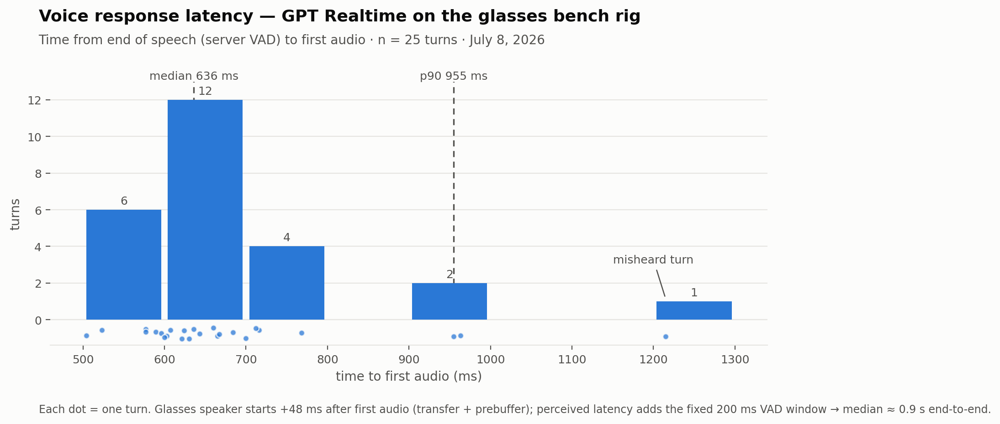

# GPT Realtime Voice Latency — USB Bench Baseline

**Date:** July 8, 2026 · **n = 25 turns** · raw data: `Realtime_Latency_Bench_raw.csv`

## Setup

Prototype electronics (XIAO ESP32-S3 Sense + custom carrier/power boards, onboard
PDM mic @ 2.048 MHz, dual MAX98357A speakers), bridged over **USB serial** by
`HardwareTest/realtime_bridge.py` to **`gpt-realtime-2.1`** (WebSocket GA API,
`reasoning.effort=low`, voice `marin`, server VAD `silence_duration_ms=200`).
Mic path: HPF + AGC (settled ~×6–7) → 16→24 kHz resample. Downlink: paced serial
frames into a 200 ms firmware prebuffer.

Measured automatically per turn:
- **TTFA** — server `speech_stopped` event → first audio delta received
  (pure model + network).
- **To-speaker** — same start → glasses speaker starts (prebuffer filled + 30 ms).
- **Perceived** latency adds the fixed 200 ms VAD silence window to To-speaker.



## Distribution (25 mixed questions: factual / yes-no / explainers / casual)

| Metric | TTFA (ms) | To-speaker (ms) | Perceived ≈ (ms) |
|---|---|---|---|
| mean | 681 | 729 | ~930 |
| median | 636 | 685 | ~885 |
| stdev | 155 | 155 | — |
| min | 504 | 552 | ~750 |
| p90 | 955 | 1004 | ~1200 |
| max | 1215 | 1264 | ~1465 |

```
TTFA, 100 ms bins
 500- 599  ######       (6)
 600- 699  ############ (12)
 700- 799  ####         (4)
 900- 999  ##           (2)   ← "Is the Sun a star?", "How's it going?"
1200-1299  #            (1)   ← misheard turn ("Here did the Berlin Wall fall.")
```

**Read:** median ~0.9 s from the moment you stop talking to the glasses speaking,
tight cluster at 600–700 ms TTFA, a thin tail above 900 ms. The single >1.2 s
outlier was also a mistranscribed turn. The serial transfer + prebuffer adds only
~48 ms over TTFA — transport is nowhere near the bottleneck; the model/network is.

**Baseline comparison:** the original sequential pipeline (Session 2) measured
**10.2–18.1 s** button-to-playback. This is a **~14× improvement** end to end.

## Bonus finding — mic accuracy at bench distance

5 of 25 turns (20%) were mistranscribed or empty *even with the AGC active*:
"Here did the Berlin Wall fall." (what year), "This is the speed of light."
(what's), "Claud's thunder." (what causes), "Romeo and Juliet" (truncated),
one empty. Consistent with `MIC_ROOT_CAUSE_ANALYSIS.md`: the model layer now
recovers gracefully (asks to repeat), but word-accuracy is mic-limited —
supports the acoustic-port work this week and the T5838 part swap on the next
PCB revision.

## Caveats

- USB serial bench, not BLE: the BLE version replaces the ~48 ms serial leg with
  a BLE leg (similar order at 2M PHY for 48 KB/s audio) — TTFA will dominate there too.
- Half-duplex turn-taking; no barge-in.
- Single session, one network (lab Wi-Fi/Ethernet), one time of day; n=25.
- `reasoning.effort=low`. Higher effort settings will grow the tail (that's the
  smartness/latency knob, `REALTIME_EFFORT` env var).
